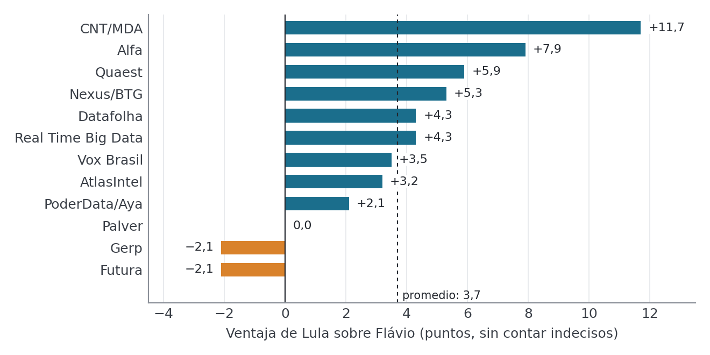
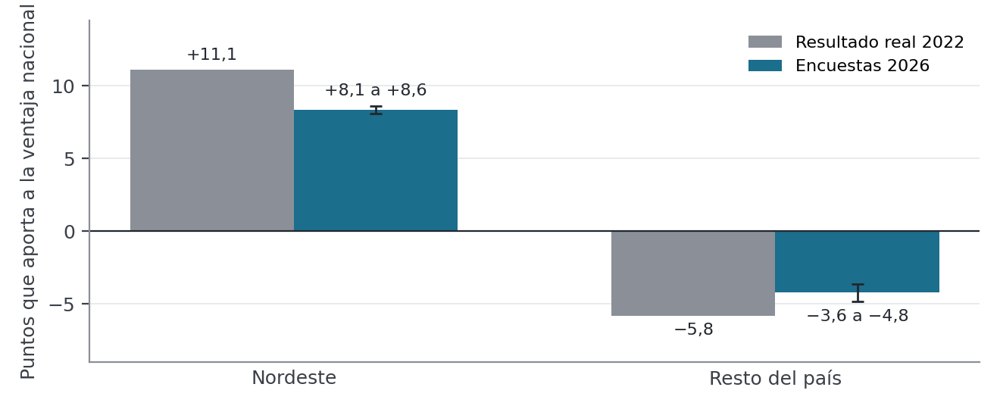
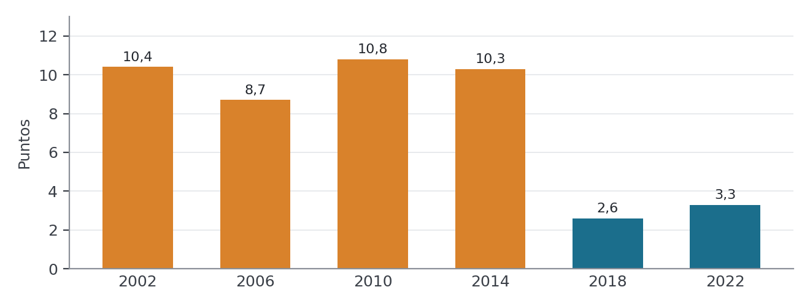
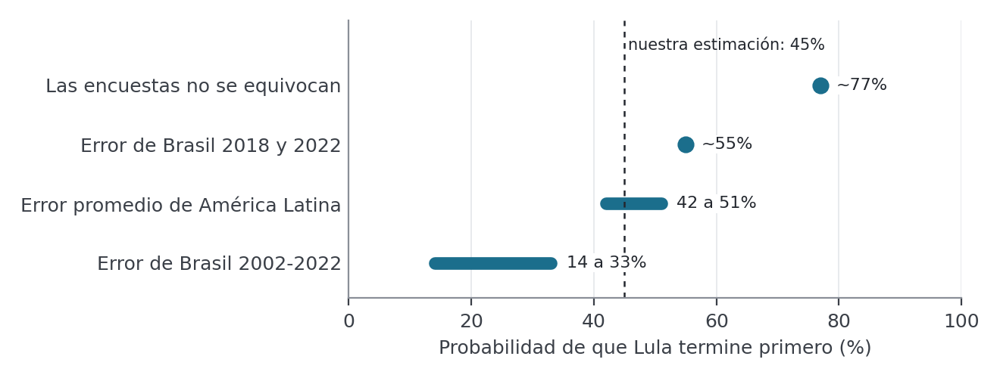

# Con un final de foto finish, Brasil elige presidente

Por Lic. Santiago Martínez Soler

**Nuestra predicción para el domingo 4 de octubre:** Lula tiene alrededor de 45% de probabilidad de terminar primero en la primera vuelta, Flávio Bolsonaro alrededor de 53% y los demás candidatos 2%. No es una estimación de cuántos votos sacará cada uno: es la probabilidad de que cada uno gane la primera vuelta, es decir, de que termine con más votos que el resto.

Es una carrera pareja: dentro de lo razonable, la probabilidad de Lula va de 35 a 55%. Las encuestas, el mercado y el historial de errores de las encuestas describen lo mismo: pareja hasta el final.

Una vez más, como en 2018 y en 2022, un Bolsonaro es el principal rival de Lula y del PT. En 2018 Jair Bolsonaro ganó la primera vuelta con 46,0% de los votos válidos contra 29,3% de Fernando Haddad, el candidato que reemplazó a un Lula preso e inhabilitado, y luego ganó el balotaje. En 2022 Lula lo superó en primera vuelta por 48,4% a 43,2% y ganó el balotaje por 50,9% a 49,1%.

En 2026 el rival es Flávio, senador e hijo de Jair, porque el expresidente está inhabilitado para competir.

## Qué dicen las encuestas

Lula lidera por unos 3 o 4 puntos, pero las consultoras (los institutos de encuestas, como se los llama en Brasil) muestran resultados muy distintos entre sí. Si se toma la última encuesta de cada una de las 12 consultoras que midieron en septiembre y se deja de lado a los indecisos, Lula promedia 44,4% y Flávio 40,8%, una ventaja de 3,7 puntos. Según la consultora, la ventaja de Lula va de −2,1 (Flávio arriba) a 11,7 puntos.

Gerp y Futura tienen a Flávio adelante y Palver lo tiene empatado. En el otro extremo, CNT/MDA (11,7 puntos a favor de Lula) y Alfa (7,9) son las que más lo favorecen. Los sitios que promedian encuestas daban a fines de septiembre una ventaja de Lula de entre 0,7 y 5 puntos: UOL 4,2, PollingData 2,6, Plano Político 2,4, BBC y CartaCapital 2, Poll+Trend 0,7 y ABC Dados 5.

Datos: [Wikipedia, encuestas de la elección presidencial 2026](https://pt.wikipedia.org/wiki/Pesquisas_de_opini%C3%A3o_para_a_elei%C3%A7%C3%A3o_presidencial_no_Brasil_em_2026).

## Qué dice el mercado

**Polymarket** es una plataforma de internet donde la gente apuesta dinero real sobre hechos futuros. Cada apuesta cuesta entre 0 y 100 centavos de dólar y paga un dólar si el hecho ocurre, así que su precio se lee como la probabilidad que el público le asigna. Sobre Brasil hay dos apuestas distintas y a fines de septiembre daban señales opuestas: Lula era favorito para ganar la primera vuelta y Flávio era favorito para ganar la presidencia.

| Mercado | Lula | Flávio | Dinero apostado |
| --- | ---: | ---: | ---: |
| [Primera vuelta: quién obtiene más votos](https://polymarket.com/event/brazil-presidential-election-first-round-winner) | 70% | 31% | US$ 560 mil |
| [Presidencia (incluye balotaje)](https://polymarket.com/event/brazil-presidential-election) | 41,5% | 58% | US$ 157 millones |

Precios leídos el 1 de octubre (primera vuelta) y el 29 de septiembre (presidencia). Para que ambas cosas sean ciertas, Flávio tendría que ganar cerca de la mitad de los balotajes en los que llegue segundo. Además, el mercado de la primera vuelta mueve poco dinero, así que su precio es el menos confiable de los dos.

## El voto por región

La ventaja de Lula depende del Nordeste, pero el resultado lo define el Sudeste. En la primera vuelta de 2022 Lula sacó 67,2% de los votos válidos (sin contar blancos ni nulos) en el Nordeste, una región que reúne al 27,7% de los votantes. Eso le dio 11,1 puntos de ventaja, y el resto del país se los descontó casi por la mitad: 5,8 puntos en contra, hasta quedar en la ventaja nacional de 5,3.

| Región (2022, primera vuelta) | Lula | Bolsonaro | Peso en el total de votos | Puntos de ventaja (o desventaja) para Lula |
| --- | ---: | ---: | ---: | ---: |
| Nordeste | 67,2% | 27,0% | 27,7% | +11,1 |
| Sudeste | 42,9% | 47,9% | 41,8% | −2,1 |
| Sur | 36,9% | 55,2% | 14,8% | −2,7 |
| Centro-Oeste | 37,9% | 54,1% | 7,5% | −1,2 |
| Norte | 47,3% | 45,5% | 8,3% | +0,1 |

Datos de 2022: [TSE, resultados por municipio y zona](https://dadosabertos.tse.jus.br).

Las encuestas regionales de 2026 muestran un patrón parecido, con un Nordeste algo menos favorable a Lula: le suma entre 8,1 y 8,6 puntos (contra 11,1 en 2022) y el resto del país le resta entre 3,6 y 4,8 (contra 5,8). Son cortes de Datafolha y Quaest de la segunda quincena de septiembre.

El Sudeste, con 42 de cada 100 votantes, es donde más pesa un error de las encuestas: si se equivocan 5 puntos ahí, la ventaja nacional cambia 2,1 puntos; en el Nordeste cambia 1,35, en el Sur 0,7 y en el Norte y el Centro-Oeste 0,4.

## Cómo se hizo el estudio y qué encontramos

Lo más importante que encontramos no salió de un modelo sofisticado, sino de mirar cuánto se equivocaron las encuestas en el pasado: en Brasil y en el resto de la región, el que lidera las encuestas suele llegar a la elección con menos ventaja de la que tenía.

Para llegar a esa conclusión hicimos tres cosas. Primero, comparamos las encuestas de la última semana con los resultados reales de 19 elecciones presidenciales: seis primeras vueltas de Brasil (2002, 2006, 2010, 2014, 2018 y 2022) y trece de otros países latinoamericanos, entre ellos Argentina, México, Ecuador, Chile, Honduras, Perú, Colombia y Venezuela. Los datos vienen de una base académica internacional (Jennings y Wlezien, *Nature Human Behaviour*, 2018) y de las tablas de encuestas de Wikipedia. Dejamos afuera Costa Rica y Bolivia 2025, donde candidatos poco conocidos dieron sorpresas que no se parecen al caso brasileño.

Segundo, probamos si sumar otras señales mejoraba la predicción: el precio de las apuestas, las visitas a Wikipedia y lo que se dice en YouTube. Evaluamos cada método en nueve elecciones recientes de la región (2023 a 2026), sacando una por vez para ver cómo le habría ido a predecirla sin conocerla. El precio de las apuestas combinado con las encuestas funcionó mejor que cada uno por separado; Wikipedia y YouTube no aportaron nada útil.

Tercero, medimos los sesgos de las encuestas:

- En la región, el líder de las encuestas perdió ventaja en 8 de 13 elecciones, en promedio unos 3,5 puntos.
- En Brasil, las encuestas le dieron al PT más ventaja de la que tuvo en las seis primeras vueltas. Hasta 2014 la diferencia fue de unos 10 puntos; en 2018 y 2022, de unos 3.
- En 2022 Lula estuvo bien medido, pero Bolsonaro salió unos 4 puntos por encima de lo que decían las encuestas. La última de Ipec le daba a Lula 14 puntos de ventaja; la real fue de 5,2.
- No encontramos que las encuestas subestimen sistemáticamente al candidato que viene creciendo al final.

Son pocas elecciones y las consultoras pueden haber cambiado sus métodos desde entonces, así que estos sesgos indican un riesgo, no una regla.

## La predicción

La predicción final: Lula tiene alrededor de 45% de probabilidad de terminar primero, Flávio Bolsonaro alrededor de 53% y los demás candidatos 2%. El rango razonable para Lula va de 35 a 55%. No es un porcentaje de votos: es la probabilidad de que cada uno gane la primera vuelta.

Hoy las encuestas le dan a Lula una ventaja de unos 3,7 puntos. Cuánto vale esa ventaja depende de si las encuestas se equivocan como en el pasado:

La cifra de 45% queda por debajo del 70% que da Polymarket para Lula en el mercado de primera vuelta. Todavía no pudimos medir cuánto se equivocan las encuestas en cada región, así que la predicción no ajusta por región. Con una ventaja de 3 o 4 puntos, un error como los del pasado alcanza para dar vuelta el resultado en cualquiera de los dos sentidos.
